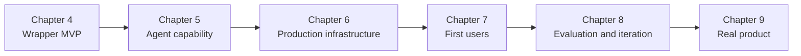

# Chapter progression

This book builds one product, ResumeRoast, through multiple stages rather than presenting a new sample project per chapter. Each stage is scoped by what the previous stage's real usage actually demands, not by what would be interesting to add.

- **Chapter 4** ships the initial scoped MVP: a wrapper on a frontier model, a Streamlit interface, PDF ingestion, and CSV storage. This is the first version a stranger can use.
- **Chapter 5** adds agency — but only once the product needs to retrieve external information (a job posting URL) or take an action beyond generating text. Agency is earned by a real gap, not added by default.
- **Chapter 6** replaces the MVP's temporary infrastructure (CSV files, email-only identification, a free deployment platform) with production infrastructure: Supabase as the durable database (the graduation trigger the Chapter 4 stack commitment already named), real authentication, logging, monitoring, rate limits, and cost controls.
- **Chapter 7** adds what's needed to get the first real users and distribution.
- **Chapter 8** adds feedback capture, prompt versioning, evaluation, and product analytics so iteration is driven by real user behaviour.
- **Chapter 9** takes the product from side project to something built to scale.

Each chapter folder in this repository captures the state of the product at the end of that chapter. Earlier folders are never rewritten to match later architecture.

